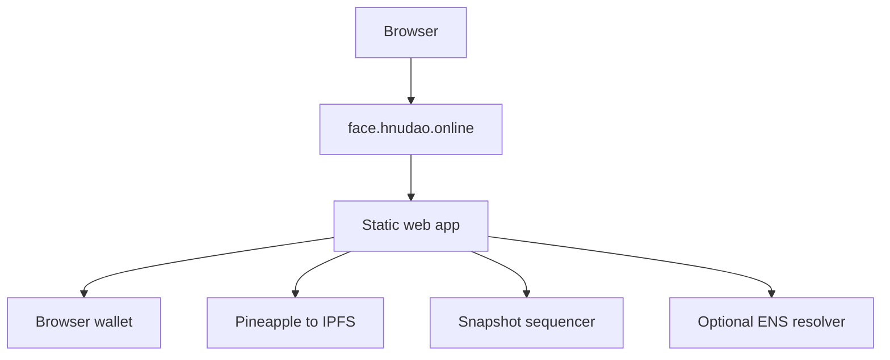

# ens-dns-bootstrap

This repository contains two deliberately separate pieces:

1. a legacy, dependency-free CLI that automates the Cloudflare side of an ENS
   onchain DNS import; and
2. a small wallet-avatar web app that does **not** require ENS.

The repository name is retained for compatibility with the existing public
project. It is no longer the product identity.

It is aimed at the workflow:

```text
existing DNS domain on Cloudflare
        ↓
enable DNSSEC
        ↓
create _ens TXT = a=0x...
        ↓
wait for DNSSEC + TXT propagation
        ↓
open ENS Manager and approve the Ethereum transaction in your wallet
```

The tool deliberately **never accepts a wallet private key or seed phrase**.

## Legacy ENS/DNS CLI

ENS already provides the protocol, contracts, Manager app, `dnsprovejs`, and ENSjs. Cloudflare already exposes DNS and DNSSEC APIs. What was missing for our use case was a small Cloudflare-first bootstrapper that performs the repetitive DNS work and tells you exactly when the domain is ready to claim.

## Requirements

- Node.js 20+
- A domain using Cloudflare authoritative DNS
- A scoped Cloudflare API token
- DNSSEC support for the TLD / registrar
- An Ethereum wallet for the final ENS onchain claim

## Cloudflare token

Create a token scoped to the single zone if possible. It needs enough permission to:

- read the zone (`Zone Read`);
- edit DNS records and DNSSEC (`DNS Write`).

Do **not** use your Global API Key.

Set it only in your shell environment:

```bash
export CLOUDFLARE_API_TOKEN='...'
```

Never commit the token to a repository.

## Run from source

```bash
git clone https://github.com/CryptographyBloke/ens-dns-bootstrap.git
cd ens-dns-bootstrap
node src/cli.mjs setup \
  --domain hnudao.online \
  --address 0x101f99125E4Aa1402f0eaEF896cC175Ba1280f0A
```

No `npm install` is required for v0.1.

The command will:

1. locate the matching Cloudflare zone;
2. enable DNSSEC if it is not already enabled;
3. create or update `_ens.<domain>` with `a=<address>` and TTL 3000;
4. poll Cloudflare for DNSSEC state;
5. verify the public TXT record through DNS-over-HTTPS and require DNSSEC authentication (`AD=true`);
6. print `readyToClaim: true` only when Cloudflare reports DNSSEC active and the public TXT answer is DNSSEC-authenticated;
7. print the ENS Manager URL for the wallet-signed claim.

## Commands

### Setup

```bash
node src/cli.mjs setup --domain example.com --address 0x...
```

Useful options:

```text
--no-wait          apply Cloudflare changes and exit immediately
--timeout 1800     maximum wait in seconds (default: 1800)
--interval 15      poll interval in seconds (default: 15)
--dry-run          show intended changes without modifying Cloudflare
--json             machine-readable output
```

### Status

```bash
node src/cli.mjs status --domain example.com --address 0x... --json
```

### Remove the ENS ownership TXT record

```bash
node src/cli.mjs remove --domain example.com --yes
```

This only removes matching `_ens` ownership records. It does **not** disable DNSSEC.

## Security model

- The Cloudflare API token stays in the local process environment.
- The CLI does not store the token.
- The CLI does not receive or store an Ethereum private key.
- Any Ethereum transaction remains an explicit wallet confirmation.
- If more than one TXT record exists at `_ens.<domain>`, the tool stops instead of guessing which record to overwrite.
- If the single existing `_ens` TXT record is not an ENS ownership record (`a=0x...`), the tool refuses to overwrite it.

## Wallet-avatar web app

The `web/` application uses existing compatibility layers instead of
introducing a new contract or registry:

```text
wallet address
      ↓ upload image to Pineapple
ipfs://CID
      ├─ EIP-712 Profile signature → Snapshot profile
      └─ optional ENS avatar record → ENS-aware applications
```

The user flow is:

1. Connect a browser wallet.
2. Choose a JPG or PNG image.
3. Upload it to IPFS through Pineapple.
4. Sign one gasless Snapshot profile update.
5. If the wallet already has an ENS primary name, optionally confirm one
   Ethereum transaction to sync its `avatar` text record.
6. Resolve the avatar by wallet address.

Snapshot and services such as Stamp that use Snapshot's avatar resolver can
display the result. ENS-aware applications can use the synced `avatar` record
when the wallet already has an ENS name. Other applications still need to
support one of these sources; no website can make arbitrary applications adopt
a new avatar source automatically.

See [`web/README.md`](web/README.md) for configuration. The browser never
receives a private key or seed phrase. Wallets without ENS still complete the
gasless Snapshot path; the ENS write is best-effort and never blocks success.

### Architecture and network path

The web app separates three different responsibilities:

- **Control:** the wallet proves that the user controls an address by signing
  in the browser. The site never asks for a seed phrase or private key.
- **Content:** the image is uploaded once to Pineapple and addressed by its
  content identifier, such as `ipfs://CID`.
- **Compatibility:** the same content URI is published through existing
  profile systems. Snapshot is the no-gas default; an existing ENS name can
  optionally receive the same URI in its `avatar` text record.

The public request and data paths are:



1. DNS maps `face.hnudao.online` to the hosted static site. The browser
   downloads only HTML, JavaScript, and CSS from the site.
2. When the user connects, JavaScript calls the wallet's EIP-1193 provider
   with `eth_requestAccounts`. The wallet returns an address; private keys
   stay inside the wallet.
3. The selected image goes directly from the browser to Pineapple. Pineapple
   stores it on IPFS and returns an `ipfs://CID` URI.
4. The browser asks the wallet to sign Snapshot's EIP-712 `Profile` message,
   then sends the signed envelope to `seq.snapshot.org`. This is the normal
   gasless path.
5. On the next connection, the app reads the current profile from
   `hub.snapshot.org/graphql`. Snapshot-compatible services can resolve the
   wallet avatar; Stamp also exposes a shareable address-based URL.
6. If the address already has an ENS primary name and resolver, the app can
   optionally send one Ethereum `setText(..., "avatar", ipfs://CID)` transaction
   through the wallet. Rejecting or skipping that transaction does not undo
   the Snapshot publication.

Logout clears the app's local connection, selected file, and preview. Wallets
that support EIP-2255 are also asked to revoke the account permission. Logout
does not delete an IPFS object or a previously published Snapshot profile.

There is no universal avatar registry: a third-party site must choose to read
Snapshot, ENS, Stamp, or another compatible source. This design maximizes
compatibility without introducing a new contract or forcing ENS setup.

## License

MIT
