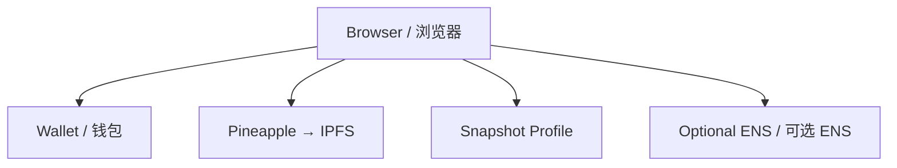

# HNUDAO Wallet Face / HNUDAO 钱包头像

An open-source, no-ENS-required wallet avatar tool. Connect a wallet, upload
an image, sign once, and publish an address-based avatar through existing
compatible services.

一个不要求 ENS 的开源钱包头像工具：连接钱包、上传图片、签名一次，
通过现有兼容服务发布与钱包地址关联的头像。

- Live site / 在线网站: <https://face.hnudao.online>
- Root domain / 根域名: <https://hnudao.online>
- Author / 作者: **HNUDAO founder**
- Telegram: <https://t.me/cryptoAceisme>
- Source / 源码: <https://github.com/CryptographyBloke/ens-dns-bootstrap>

The site is built by a HNUDAO member. HNUDAO is the project contributor,
not a required protocol or identity provider.

本网站由 HNUDAO 成员开发。HNUDAO 是项目贡献方，不是本工具运行所必需的
协议或身份服务商。

## What it does / 功能

1. Connect a browser wallet through EIP-1193.
2. Choose a JPG or PNG avatar under 1 MB.
3. Upload the image through Pineapple and receive an `ipfs://CID` URI.
4. Sign one gasless EIP-712 Snapshot `Profile` update.
5. Optionally sync the same URI to an existing ENS `avatar` record.
6. Read the current avatar again by wallet address.

1. 通过 EIP-1193 连接浏览器钱包。
2. 选择一张不超过 1 MB 的 JPG 或 PNG 图片。
3. 通过 Pineapple 上传并获得 `ipfs://CID` 地址。
4. 签署一次无需 Gas 的 Snapshot EIP-712 `Profile` 更新。
5. 如果钱包已有 ENS 名称，可选择同步 ENS 的 `avatar` 记录。
6. 下次连接时，可以通过钱包地址读取当前头像。

ENS is optional. Wallets without ENS still use the gasless Snapshot path. The
website never asks for a seed phrase or private key.

ENS 是可选项。没有 ENS 的钱包仍然可以使用无需 Gas 的 Snapshot 流程。
网站不会索要助记词或私钥。

## Compatibility / 兼容性

- **Snapshot:** the avatar is published in the user's Snapshot profile.
- **Stamp:** the app provides a shareable address-based avatar URL.
- **ENS-aware applications:** they can use the optional ENS `avatar` record.
- **IPFS-aware applications:** they can resolve the content-addressed image.

- **Snapshot：**头像发布到用户的 Snapshot Profile。
- **Stamp：**网站提供基于钱包地址的可分享头像链接。
- **支持 ENS 的应用：**可以读取可选同步的 ENS `avatar` 记录。
- **支持 IPFS 的应用：**可以解析内容寻址的图片。

There is no universal avatar registry. A third-party website must choose to
read Snapshot, ENS, Stamp, IPFS, or another source; arbitrary websites cannot
be forced to adopt a new avatar source.

不存在能够强制所有网站显示头像的统一注册表。第三方网站必须主动选择
读取 Snapshot、ENS、Stamp、IPFS 或其他来源。

## Architecture / 架构

The current web app separates three responsibilities:

当前 Web 应用把三个职责分开：

- **Control / 控制权:** the wallet signs for the address; private keys stay in
  the wallet. 钱包通过签名证明地址控制权，私钥始终留在钱包中。
- **Content / 内容:** the image is stored through Pineapple and addressed by
  an IPFS CID. 图片通过 Pineapple 存储，并由 IPFS CID 定位。
- **Compatibility / 兼容层:** the same URI is published through Snapshot and,
  optionally, ENS. 同一个 URI 通过 Snapshot，以及可选的 ENS 发布。



## Network path / 网络访问路径

1. DNS sends `face.hnudao.online` to the hosted static site.
2. The browser loads the HTML, JavaScript, and CSS application.
3. Wallet requests and signatures stay between the browser and the wallet
   provider.
4. The selected image goes from the browser to Pineapple and returns an
   `ipfs://CID` URI.
5. The signed Snapshot message goes to the Snapshot sequencer; profile reads
   use the Snapshot Hub GraphQL API.
6. If enabled, the ENS adapter sends one Ethereum transaction to the existing
   resolver.

1. DNS 将 `face.hnudao.online` 指向托管的静态网站。
2. 浏览器加载 HTML、JavaScript 和 CSS 应用。
3. 钱包请求与签名发生在浏览器和钱包提供者之间。
4. 头像从浏览器上传到 Pineapple，并返回 `ipfs://CID`。
5. 签名后的 Snapshot 消息提交到 Snapshot Sequencer；资料读取使用
   Snapshot Hub GraphQL API。
6. 如果启用 ENS 同步，适配器会向已有 Resolver 发起一笔以太坊交易。

Logout clears the local connection, selected file, and preview. It does not
delete an IPFS object or an already-published Snapshot profile.

Logout 会清除本地连接、选中的文件和预览，但不会删除 IPFS 对象或已经发布
的 Snapshot Profile。

## Repository layout / 仓库结构

```text
src/                 Legacy Cloudflare/ENS DNS bootstrap CLI
web/                 Current wallet-avatar web app
.github/workflows/   Web build and protocol checks
```

The original CLI is retained for compatibility with the first version of the
project. The current avatar website does not require the CLI, DNSSEC, or ENS.

旧版 CLI 为兼容项目第一阶段而保留。当前钱包头像网站不要求使用 CLI、DNSSEC
或 ENS。

## Local development / 本地开发

```bash
cd web
npm ci
npm run dev
```

Build and run the protocol check:

构建并运行协议检查：

```bash
npm run build
npm run test:protocol
```

The web app uses these public defaults:

Web 应用默认使用以下公开服务：

```text
Snapshot Hub:        https://hub.snapshot.org/graphql
Snapshot Sequencer:  https://seq.snapshot.org
IPFS gateway:        https://ipfs.io/ipfs/
Ethereum RPC:        https://cloudflare-eth.com
```

## Legacy CLI / 旧版 CLI

The CLI automates the repetitive Cloudflare side of an ENS DNS import. It does
not perform the final wallet-signed Ethereum claim and never accepts a private
key or seed phrase.

该 CLI 用于自动化 ENS DNS 导入中的 Cloudflare 部分，不会代替钱包执行最终的
以太坊 Claim 交易，也不会接受私钥或助记词。

Requirements / 环境要求:

- Node.js 20+
- A domain using Cloudflare authoritative DNS / 使用 Cloudflare 权威 DNS 的域名
- A scoped Cloudflare API token / 权限受限的 Cloudflare API Token
- DNSSEC support for the domain suffix / 域名后缀支持 DNSSEC
- A wallet for the final on-chain claim / 用于最终链上 Claim 的钱包

Example / 示例：

```bash
node src/cli.mjs setup --domain example.com --address 0x...
node src/cli.mjs status --domain example.com --address 0x... --json
node src/cli.mjs remove --domain example.com --yes
```

## Security / 安全

- Never put a Cloudflare token, private key, or seed phrase in Git.
- Wallet transactions and EIP-712 signatures remain explicit wallet actions.
- The browser client does not receive a private key or seed phrase.
- Logout does not erase decentralized data already published elsewhere.

- 不要把 Cloudflare Token、私钥或助记词放进 Git。
- 链上交易和 EIP-712 签名始终由钱包明确确认。
- 浏览器客户端不会接收私钥或助记词。
- Logout 不会删除已经发布到其他去中心化服务的数据。

## License / 许可证

MIT
